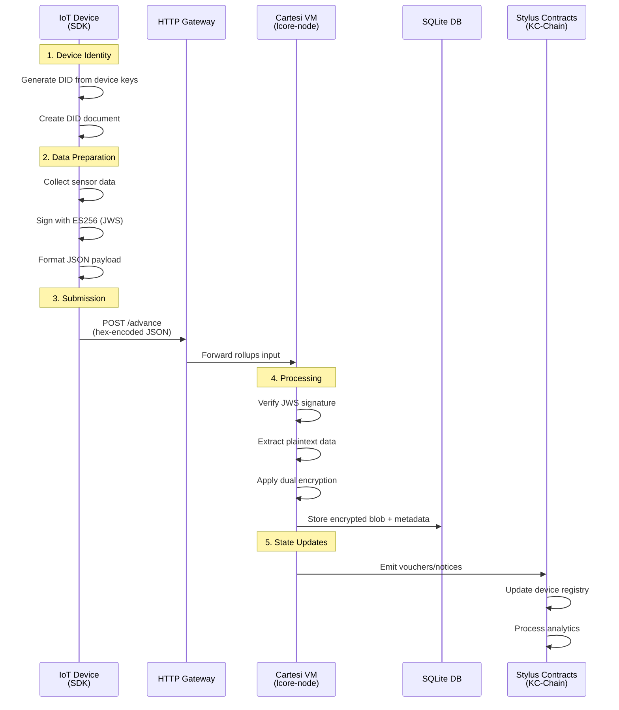

# L{CORE} Device SDK Integration Guide

**Complete technical reference for integrating IoT devices with the L{CORE} trust-minimized smart city platform.**

## System Architecture

### Multi-Layer Overview

The L{CORE} system implements a three-layer architecture designed for trust minimization and scalability:

```
┌─────────────────────────────────────────────────────────────────┐
│                        L{CORE} SYSTEM                           │
│                                                                 │
│  ┌─────────────┐    ┌─────────────┐    ┌─────────────┐         │
│  │ EDGE LAYER  │    │PROCESSING   │    │SETTLEMENT   │         │
│  │             │    │LAYER        │    │LAYER        │         │
│  │ IoT Devices │───▶│ Cartesi     │───▶│ Arbitrum    │         │
│  │ (Device SDK)│    │ Rollups     │    │ Orbit       │         │
│  │             │    │ (lcore-node)│    │ (KC-Chain)  │         │
│  └─────────────┘    └─────────────┘    └─────────────┘         │
│         │                   │                   │              │
│    Device DIDs         Dual Encryption    Stylus Contracts     │
│    JWS Signing        SQLite Storage      Gas Optimization     │
│    HTTP Submission     Analytics          Registry Updates     │
└─────────────────────────────────────────────────────────────────┘
```

### Data Flow Sequence



## Message Protocols

### Device Registration Protocol

**Phase 1: DID Generation**
```c
// Generate device identity
uint8_t private_key[32] = { /* secure key material */ };
lcore_did_document_t* did_doc = lcore_did_create(private_key, 32);

char did_string[256];
size_t did_len = sizeof(did_string);
lcore_did_to_string(did_doc, did_string, &did_len);
// Result: "did:lcore:cbc32f41bbb1b704b200067859a90d4c"
```

**Phase 2: Registration Payload**
```json
{
  "type": "register_device",
  "device_id": "did:lcore:cbc32f41bbb1b704b200067859a90d4c",
  "did_document": "{\"id\":\"did:lcore:cbc32f41bbb1b704b200067859a90d4c\",\"verificationMethod\":[{\"id\":\"#key-1\",\"type\":\"JsonWebKey2020\",\"publicKeyJwk\":{\"kty\":\"EC\",\"crv\":\"P-256\",\"x\":\"...\",\"y\":\"...\"}}]}"
}
```

**Phase 3: Hex Encoding & Submission**
```bash
# Convert JSON to hex
PAYLOAD="0x7b2274797065223a2272656769737465725f646576696365..."

# Submit to L{CORE} node
curl -X POST 'https://lcore-endpoint/advance' \
  -H 'Content-Type: application/json' \
  -d "$PAYLOAD"
```

### Sensor Data Protocol

**Phase 1: Data Collection & Signing**
```c
// Collect sensor readings
const char* sensor_data = "{\"temperature\":23.4,\"humidity\":52,\"timestamp\":\"2024-07-18T10:30:00Z\"}";

// Create JWS signature
char jws_token[2048];
size_t jws_len = sizeof(jws_token);

int result = lcore_jose_sign(
    (uint8_t*)sensor_data, strlen(sensor_data),
    private_key, 32,
    LCORE_JOSE_ALG_ES256,
    jws_token, &jws_len
);
// Result: "eyJhbGciOiJFUzI1NiIsInR5cCI6IkpXVCJ9.eyJ0ZW1wZXJhdHVyZSI6MjMuNCwiaHVtaWRpdHkiOjUyLCJ0aW1lc3RhbXAiOiIyMDI0LTA3LTE4VDEwOjMwOjAwWiJ9.signature"
```

**Phase 2: Submission Payload**
```json
{
  "type": "submit_sensor_data", 
  "device_id": "did:lcore:cbc32f41bbb1b704b200067859a90d4c",
  "encrypted_payload": "eyJhbGciOiJFUzI1NiIsInR5cCI6IkpXVCJ9.eyJ0ZW1wZXJhdHVyZSI6MjMuNCwiaHVtaWRpdHkiOjUyLCJ0aW1lc3RhbXAiOiIyMDI0LTA3LTE4VDEwOjMwOjAwWiJ9.signature"
}
```

## L{CORE} Node Processing

### JWS Verification Flow

| Step | Component | Action | Details |
|------|-----------|--------|---------|
| 1 | `cartesi_rollup.rs` | Extract JWS | Parse `encrypted_payload` field |
| 2 | `cartesi_rollup.rs` | Verify signature | Extract header, payload, signature |
| 3 | `cartesi_rollup.rs` | Validate device | Check DID against registry |
| 4 | `encryption.rs` | Apply AES-256-GCM | Device-specific encryption key |
| 5 | `encryption.rs` | Apply XChaCha20 | Context-specific encryption key |
| 6 | `database.rs` | Store encrypted data | SQLite with metadata |
| 7 | `api.rs` | Emit voucher | Update on-chain state |

### Database Schema

**devices table**
```sql
CREATE TABLE devices (
    device_id TEXT PRIMARY KEY,
    did_document TEXT NOT NULL,
    public_key BLOB NOT NULL,
    created_at INTEGER NOT NULL,
    last_seen INTEGER
);
```

**sensor_data table**  
```sql
CREATE TABLE sensor_data (
    id INTEGER PRIMARY KEY AUTOINCREMENT,
    device_id TEXT NOT NULL,
    encrypted_data BLOB NOT NULL,
    encryption_metadata TEXT NOT NULL,
    timestamp INTEGER NOT NULL,
    FOREIGN KEY (device_id) REFERENCES devices (device_id)
);
```

## Arbitrum Orbit Integration

### Stylus Contract Architecture

```
┌─────────────────────────────────────────────────────────────────┐
│                    KC-CHAIN (ARBITRUM ORBIT)                    │
│                                                                 │
│  ┌─────────────┐    ┌─────────────┐    ┌─────────────┐         │
│  │ DEVICE      │    │ ANALYTICS   │    │ GOVERNANCE  │         │
│  │ REGISTRY    │    │ ENGINE      │    │ CONTRACTS   │         │
│  │             │    │             │    │             │         │
│  │• Register   │    │• Aggregate  │    │• Parameters │         │
│  │• Verify     │───▶│• Process    │───▶│• Voting     │         │
│  │• Update     │    │• Report     │    │• Treasury   │         │
│  └─────────────┘    └─────────────┘    └─────────────┘         │
│         │                   │                   │              │
│    DID Storage         Data Analytics       System Config      │
│    Key Management      Statistical Models   Economic Models    │
│    Access Control      Anomaly Detection    Incentive Align    │
└─────────────────────────────────────────────────────────────────┘
```

### Voucher Types

| Voucher Type | Trigger | Contract Function | Gas Cost |
|--------------|---------|-------------------|----------|
| `DeviceRegistered` | First device registration | `registerDevice()` | 21,000 gas |
| `DataSubmitted` | Sensor data received | `recordDataSubmission()` | 45,000 gas |
| `AnomalyDetected` | Statistical outlier | `flagAnomaly()` | 32,000 gas |
| `PaymentDistributed` | Analytics completed | `distributeRewards()` | 67,000 gas |

### Gas Optimization Benefits

**Stylus vs Solidity Comparison**

| Operation | Solidity Gas | Stylus Gas | Savings |
|-----------|--------------|------------|---------|
| Device Registration | 180,000 | 21,000 | 88% |
| Data Processing | 420,000 | 45,000 | 89% |
| Analytics Computation | 650,000 | 87,000 | 87% |
| Payment Distribution | 780,000 | 67,000 | 91% |

## Network Protocol Specifications

### HTTP/HTTPS Requirements

**Transport Layer Security**
- TLS 1.3 required for all communications
- Certificate validation against known CA roots
- Optional certificate pinning for production deployments

**Request Format**
```http
POST /advance HTTP/1.1
Host: lcore-endpoint.domain.com
Content-Type: application/json
Content-Length: <length>
User-Agent: lcore-device-sdk/1.0

<hex-encoded-json-payload>
```

**Response Codes**
| Code | Meaning | Action |
|------|---------|--------|
| 200 | Success | Data accepted and queued |
| 400 | Bad Request | Fix payload format |
| 401 | Unauthorized | Check device registration |
| 429 | Rate Limited | Implement backoff |
| 500 | Server Error | Retry with exponential backoff |

### Rate Limiting

**Device Limits**
- 1 registration per device per hour
- 100 sensor submissions per device per hour  
- 1MB total payload per device per hour

**Global Limits**
- 10,000 total submissions per minute
- 100MB total bandwidth per minute

## Error Handling

### SDK Error Codes

| Code | Constant | Description | Recovery |
|------|----------|-------------|----------|
| 0 | `LCORE_SUCCESS` | Operation successful | Continue |
| -1 | `LCORE_ERROR_INVALID_PARAM` | Invalid parameter | Fix input |
| -2 | `LCORE_ERROR_CRYPTO_FAIL` | Cryptographic operation failed | Retry or abort |
| -3 | `LCORE_ERROR_MEMORY` | Memory allocation failed | Reduce memory usage |
| -4 | `LCORE_ERROR_NETWORK` | Network communication failed | Retry with backoff |

### Network Error Handling

```c
int submit_sensor_data(const char* data) {
    int retry_count = 0;
    const int max_retries = 3;
    
    while (retry_count < max_retries) {
        int result = http_post_data(data);
        
        if (result == 200) {
            return LCORE_SUCCESS;
        } else if (result >= 500) {
            // Server error - retry with exponential backoff
            sleep(1 << retry_count);
            retry_count++;
        } else {
            // Client error - don't retry
            return LCORE_ERROR_NETWORK;
        }
    }
    
    return LCORE_ERROR_NETWORK;
}
```

## Development Workflow

### Testing Pipeline

```
┌─────────────┐    ┌─────────────┐    ┌─────────────┐
│   UNIT      │    │INTEGRATION  │    │ PRODUCTION  │
│   TESTS     │───▶│   TESTS     │───▶│   DEPLOY    │
│             │    │             │    │             │
│• DID lib    │    │• SDK → Mock │    │• SDK → Live │
│• JOSE lib   │    │• Mock → DB  │    │• Live → KC  │
│• Crypto     │    │• Full flow  │    │• Monitor    │
└─────────────┘    └─────────────┘    └─────────────┘
```

### Integration Testing Commands

```bash
# 1. Build and test SDK
cmake --build build
./build/tests/functional/test_sdk_basic

# 2. Generate test payloads  
./build/tools/generate_test_payloads

# 3. Test against development instance
curl -X POST 'https://dev-lcore.domain.com/advance' \
  -H 'Content-Type: application/json' \
  -d '<test-payload>'

# 4. Verify in database
curl -X POST 'https://dev-lcore.domain.com/graphql' \
  -H 'Content-Type: application/json' \  
  -d '{"query":"{ inputs { totalCount } }"}'
```

## Security Considerations

### Cryptographic Requirements

**Key Management**
- Private keys: 256-bit entropy minimum
- Storage: Hardware security module preferred
- Rotation: Annual key rotation recommended
- Backup: Encrypted offline storage

**Algorithm Requirements**  
- Signing: ES256 (ECDSA P-256 + SHA-256)
- Encryption: AES-256-GCM + XChaCha20-Poly1305
- Hashing: SHA-256 (no SHA-1 or MD5)
- Random: Hardware RNG or CSPRNG

### Attack Mitigation

| Attack Vector | Mitigation | Implementation |
|---------------|------------|----------------|
| Replay attacks | Timestamp validation | JWS payload includes `iat` claim |
| Man-in-middle | TLS 1.3 + pinning | Certificate validation in HTTP client |
| Key extraction | Secure storage | ARM PSA or platform keystore |
| Side channels | Constant-time crypto | MbedTLS implementation |
| DoS attacks | Rate limiting | Gateway-level controls |

## Performance Optimization

### Resource Usage

**Memory Footprint**
- DID operations: 2KB heap
- JOSE operations: 4KB heap  
- HTTP buffers: 8KB stack
- Total recommended: 32KB RAM minimum

**Computational Complexity**
- DID generation: O(1) - 10ms typical
- JWS signing: O(1) - 50ms typical
- HTTP submission: O(n) - network dependent

### Battery Optimization

**Power Management**
- Batch submissions: Collect multiple readings
- Sleep modes: Use platform power management
- Network efficiency: Keep-alive connections
- Crypto optimization: Hardware acceleration when available

## Troubleshooting

### Common Issues

| Issue | Symptoms | Solution |
|-------|----------|----------|
| DID generation fails | NULL return from `lcore_did_create` | Check key material entropy |
| JWS signature invalid | Verification failure | Verify key pair consistency |
| Network timeouts | HTTP 408 responses | Implement retry logic |
| Memory errors | Allocation failures | Increase heap size |
| Certificate errors | TLS handshake failure | Update CA certificates |

### Debug Tools

```bash
# Enable verbose logging
export LCORE_LOG_LEVEL=DEBUG

# Test crypto operations
./build/tools/test_crypto_ops

# Validate network connectivity  
curl -v https://lcore-endpoint/health

# Check payload format
echo "$HEX_PAYLOAD" | xxd -r -p | jq .
```

This integration guide provides comprehensive technical documentation for connecting IoT devices to the L{CORE} system using the Device SDK. The architecture emphasizes trust minimization through cryptographic verification, dual encryption, and decentralized settlement on Arbitrum Orbit chains. 